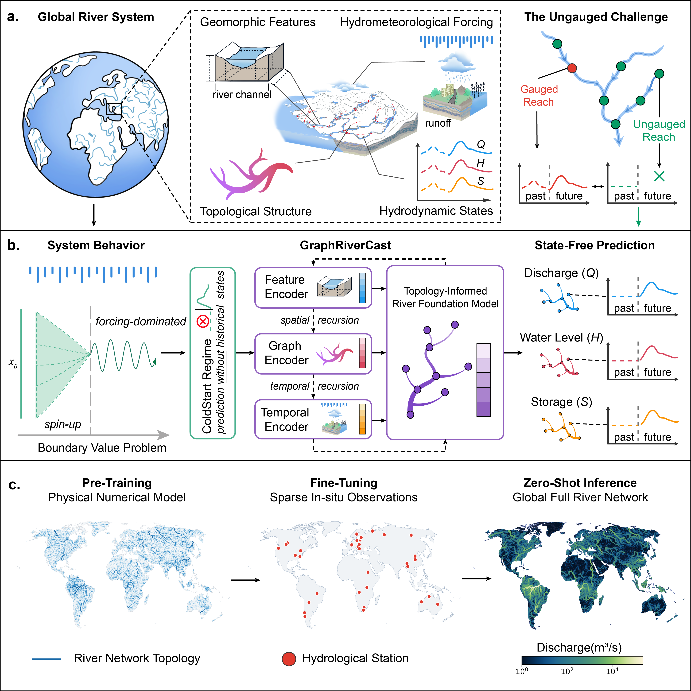
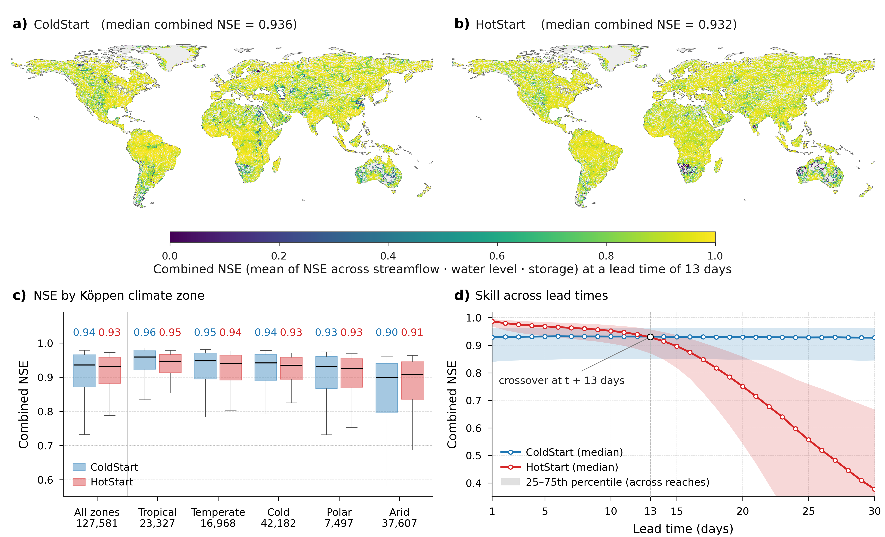

<div align="center">

# GraphRiverCast

[](https://arxiv.org/abs/2602.22293)
[](https://www.python.org/)
[](https://pytorch.org/)
[](https://pyg.org/)
[](LICENSE)

**Topology enables learning-based prediction of global river hydrodynamics**

[Hancheng Ren](mailto:)<sup>1,2</sup>,
[Gang Zhao](mailto:zhao.g.eb91@m.isct.ac.jp)<sup>1,3,†</sup>,
[Shuo Wang](mailto:)<sup>4</sup>,
[Louise Slater](mailto:)<sup>2</sup>,
[Dai Yamazaki](mailto:)<sup>5</sup>,
Shu Liu<sup>6</sup>,
Jingfang Fan<sup>4</sup>,
Shibo Cui<sup>7</sup>,
Ziming Yu<sup>8</sup>,
Shengyu Kang<sup>9</sup>,
Depeng Zuo<sup>1</sup>,
Dingzhi Peng<sup>1</sup>,
Zongxue Xu<sup>1</sup>,
[Bo Pang](mailto:pb@bnu.edu.cn)<sup>1,†</sup>

<sup>1</sup>Beijing Normal University &nbsp;
<sup>2</sup>University of Oxford &nbsp;
<sup>3</sup>Institute of Science Tokyo &nbsp;
<sup>4</sup>Beijing Normal University (Systems Science) &nbsp;
<sup>5</sup>University of Tokyo &nbsp;
<sup>6</sup>China Institute of Water Resources and Hydropower Research &nbsp;
<sup>7</sup>Tsinghua University &nbsp;
<sup>8</sup>Beijing Normal University (AI) &nbsp;
<sup>9</sup>Wuhan University

<sup>†</sup> Corresponding authors

arXiv preprint, 2026

---

</div>

<p align="center">
  
</p>
<p align="center"><b>Figure 1.</b> GraphRiverCast enables state-free, zero-shot prediction of global river hydrodynamics. <b>a,</b> The global river network (127,581 reaches, ~4.4 million km). <b>b,</b> Dynamical rationale: rivers are strongly dissipative — initial-state influence decays, making state-free (ColdStart) prediction tractable. Architecture: feature encoder + graph encoder (signed bidirectional GCN) + temporal encoder (LSTM). <b>c,</b> Two-stage training: pretrain on CaMa-Flood simulations → finetune on sparse GRDC gauges → zero-shot global inference.</p>

---

## Highlights

- **State-free prediction (ColdStart)** — reconstructs discharge, water depth and channel storage across 127,581 river reaches worldwide without any historical river states
- **Single unified global model** — one model for the entire planet, not a patchwork of basin-specific models
- **~97K parameters** — lightweight enough to run inference on a consumer GPU
- **ColdStart NSE 0.936** at 13-day lead, sustaining skill out to 700+ days (100× beyond training horizon)
- **Topology-dominant** — encoder ablation shows graph topology contributes 50% of ColdStart skill vs 12% for temporal memory
- **Pretrain → finetune paradigm** — pretrained on physics-based CaMa-Flood simulations, finetuned with 1,996 sparse GRDC gauge stations

---

## Table of Contents

- [Quick Start](#-quick-start)
- [Overview](#-overview)
- [Model Architecture](#-model-architecture)
- [Node & Edge Feature Specification](#-node--edge-feature-specification)
- [Global Performance](#-global-performance)
- [Installation](#-installation)
- [Data](#-data)
- [Inference](#-inference)
- [Checkpoints](#-checkpoints)
- [Hyperparameters](#-hyperparameters)
- [Citation](#-citation)
- [License](#-license)

---

## 🚀 Quick Start

```bash
# 1. Clone
git clone https://github.com/HanchengRen/GraphRiverCast.git
cd GraphRiverCast

# 2. Install
conda env create -f environment.yml
conda activate graphrivercast

# 3. Run inference (prepare your data first — see Data section)
python -m src.inference \
    --checkpoint checkpoints/pretrain/GRC_ColdStart.ckpt \
    --data-dir ./data/global \
    --start-date 2015-01-01 \
    --history 365 --future 365
```

---

## 🌊 Overview

Rivers are central to the global water cycle, yet ~60% of basins lack long-term records needed to initialise standard autoregressive models. GraphRiverCast exploits the **strongly dissipative** nature of rivers — unlike the chaotic atmosphere, river initial-condition perturbations decay rather than amplify — enabling **state-free prediction** from runoff forcing and network topology alone.

### ColdStart vs HotStart

| Regime | Initial State | Input Data | Use Case |
|:---|:---|:---|:---|
| **ColdStart** | Zero (no historical states) | Runoff forcing + topology + geomorphic features | Ungauged reaches, long-horizon prediction |
| **HotStart** | From simulation/observation | All of the above + historical river states | Short-term forecasting in gauged reaches |

> **Key finding:** At 13-day lead time, ColdStart (median NSE = 0.936) matches HotStart (0.932). Beyond day 13, ColdStart sustains skill while HotStart degrades to ~0.4 by day 30 due to autoregressive error compounding. ColdStart maintains NSE ≈ 0.93 out to 700 days — a 100× extrapolation beyond the 7-day training horizon.

---

## 🧬 Model Architecture

GraphRiverCast is a spatio-temporal graph neural network with three complementary encoders operating on a signed directed graph $\mathcal{G}=(\mathcal{V},\mathcal{E}^+,\mathcal{E}^-)$ of $N=127{,}581$ river reaches and $E=127{,}580$ directed edges.

### Computational Flow

At each timestep $t$, the model processes a per-reach feature vector through the following pipeline:

```
   ╔═══════════════════════════════════════════════════════════════════════╗
   ║  Per-reach input vector  x_t ∈ ℝ^32                                 ║
   ║  ┌──────────┐ ┌──────────────────┐ ┌───────────────────────────┐    ║
   ║  │ runoff(1)│ │ river state Q,H,S│ │ static geomorphic (28-d) │    ║
   ║  └─────┬────┘ └────────┬─────────┘ └──────────────┬────────────┘    ║
   ║        └───────────────┼──────────────────────────┘                 ║
   ╚════════════════════════╪════════════════════════════════════════════╝
                            ▼
                 ┌─────────────────────┐
                 │ Embedding  Linear   │  x → ℝ^H
                 └──────────┬──────────┘
                            ▼
              ┌───────────────────────────┐
              │     Feature Mixing        │
              │ z = x + MLP(RMSNorm(x))   │  SiLU activation
              │ ℝ^H → ℝ^128 → ℝ^H        │  residual connection
              └─────────────┬─────────────┘
                            ▼
   ╔════════════════════════════════════════════════════════════════════╗
   ║  Signed GCN Encoder  (L = 2 layers)                               ║
   ║                                                                    ║
   ║    ┌────────────────────────┐   ┌────────────────────────┐        ║
   ║    │ Positive Path (ε⁺)    │   │ Negative Path (ε⁻)    │        ║
   ║    │ upstream → downstream  │   │ downstream → upstream  │        ║
   ║    │                        │   │                        │        ║
   ║    │  EdgeAttrConv × L      │   │  EdgeAttrConv × L      │        ║
   ║    │  + GELU + residual     │   │  + GELU + residual     │        ║
   ║    │  edge_attr: 9-dim      │   │  edge_attr: 9-dim      │        ║
   ║    └──────────┬─────────────┘   └──────────┬─────────────┘        ║
   ║               │    h_pos                    │    h_neg             ║
   ║               └──────────┬─────────────────┘                      ║
   ║                          ▼                                         ║
   ║           ┌──────────────────────────┐                             ║
   ║           │  Per-node Fusion Gate g   │                             ║
   ║           │  g = σ(W[h⁺ ‖ h⁻] + b)  │                             ║
   ║           │  x ← x + g·h⁺ + (1−g)·h⁻│                             ║
   ║           └──────────────────────────┘                             ║
   ╚═══════════════════════════╪════════════════════════════════════════╝
                               ▼
   ╔════════════════════════════════════════════════════════════════════╗
   ║  Temporal Encoder                                                  ║
   ║                                                                    ║
   ║  ┌──────────────────────────────────────────────┐                 ║
   ║  │  LSTMCell(RMSNorm(x_t), RMSNorm(h_{t-1}),   │                 ║
   ║  │           RMSNorm(c_{t-1}))                   │                 ║
   ║  │                                               │                 ║
   ║  │  h_t, c_t ← LSTM(x_t, h_{t-1}, c_{t-1})     │                 ║
   ║  │  x_t ← x_t + h_t                             │                 ║
   ║  └──────────────────────────────────────────────┘                 ║
   ╚═══════════════════════════╪════════════════════════════════════════╝
                               ▼
                 ┌──────────────────────────┐
                 │    Residual Readout      │
                 │  Δ = Linear(RMSNorm(x))  │
                 │  ŷ_t = y_{t-1} + Δ       │  y = (Q, H, S)
                 └──────────────────────────┘
```

### EdgeAttrConv — Edge-Attribute-Gated Message Passing

The core message passing layer modulates neighbor messages with direction-aware hydraulic edge attributes:

$$\mathbf{m}_{j \to i} = \mathbf{W}\mathbf{x}_j \odot \sigma\!\left(\mathrm{MLP}(\mathbf{e}_{j \to i})\right)$$

$$\mathbf{x}_i' = \sum_{j \in \mathcal{N}(i)} \mathbf{m}_{j \to i}$$

where $\mathbf{e}_{j \to i} \in \mathbb{R}^9$ are the direction-specific edge attributes (8 static hydraulic-geometric + 1 dynamic water-depth gradient), and $\sigma$ is the sigmoid gating function. The MLP consists of two linear layers with SiLU activation.

### Fusion Gate — Bidirectional Information Integration

Each reach $i$ receives information from both upstream (positive) and downstream (negative) paths:

$$g_i = \sigma(\mathbf{W}_g[\mathbf{h}_i^+ \| \mathbf{h}_i^-] + \mathbf{b}_g)$$

$$\mathbf{x}_i \leftarrow \mathbf{x}_i + g_i \cdot \mathbf{h}_i^+ + (1 - g_i) \cdot \mathbf{h}_i^-$$

The model learns per-node routing decisions — upstream-dominated reaches (confluences) naturally develop $g_i \to 1$, while downstream-influenced reaches (backwater, tidal) develop $g_i \to 0$.

### Model Specifications

| Component | Specification |
|:---|:---|
| **Architecture** | SignedGCN (2-layer) + LSTMCell + RMSNorm |
| **Total parameters** | **96,643** |
| **Hidden dimension** $H$ | 64 |
| **Feature mixing dimension** | 128 |
| **GCN layers** $L$ | 2 |
| **Input dimension** | 32 (1 runoff + 3 river + 28 static) |
| **Output dimension** | 3 (Q, H, S) |
| **Edge attribute dimension** | 9 (8 static + 1 dynamic) |
| **Normalization** | RMSNorm (Zhang & Sennrich, 2019) |
| **Activation** | GELU (GCN), SiLU (feature mixing) |
| **Dropout** | 0.1 |

---

## 📐 Node & Edge Feature Specification

### Node Features (32 dimensions)

GraphRiverCast concatenates three feature groups into a 32-dimensional per-reach input vector:

<table>
<tr>
  <th>Group</th>
  <th>Dim</th>
  <th>Components</th>
  <th>Source</th>
</tr>
<tr>
  <td rowspan="1"><b>Forcing</b></td>
  <td>1</td>
  <td>Runoff <code>R</code></td>
  <td>GRADES</td>
</tr>
<tr>
  <td rowspan="1"><b>River State</b></td>
  <td>3</td>
  <td>Discharge <code>Q</code>, Water depth <code>H</code>, Channel storage <code>S</code></td>
  <td>CaMa-Flood / predicted</td>
</tr>
<tr>
  <td rowspan="4"><b>Static Geomorphic</b></td>
  <td>10</td>
  <td>Catchment area, Ground elevation, Channel depth, Manning <i>n</i>, Grid area, Downstream distance, Channel length, Channel width, Upstream area, Bankfull width</td>
  <td>MERIT Hydro / CaMa-Flood</td>
</tr>
<tr>
  <td>8</td>
  <td>Dynamic statistics: μ(Q), σ(Q), μ(H), σ(H), μ(S), σ(S), μ(R), σ(R)</td>
  <td>Computed from training period</td>
</tr>
<tr>
  <td>10</td>
  <td>Floodplain height profile (10 elevation bins)</td>
  <td>CaMa-Flood</td>
</tr>
<tr>
  <td><b>= 28</b></td>
  <td colspan="2"><i>Static subtotal</i></td>
</tr>
</table>

### Edge Attributes (9 dimensions)

Each directed edge carries a **9-dimensional attribute vector** encoding hydraulic-geometric properties that govern flow routing. Attributes are computed separately for positive (upstream→downstream) and negative (downstream→upstream) directions:

| Dim | Attribute | Forward (ε⁺) Formula | Physical Meaning |
|:---:|:---|:---|:---|
| 0 | Ground slope | $(z_{\rm src} - z_{\rm dst}) / d \times 10^3$ | Gravitational driving gradient (‰) |
| 1 | Bed slope | $((z_{\rm src} - h_{\rm src}^{\rm bed}) - (z_{\rm dst} - h_{\rm dst}^{\rm bed})) / d \times 10^3$ | Riverbed gradient, determines base flow (‰) |
| 2 | Elevation diff | $z_{\rm src} - z_{\rm dst}$ | Absolute drop between reaches (m) |
| 3 | Distance | $d_{\rm src \to dst}$ | Inter-node channel distance (m) |
| 4 | Manning coeff | $n_{\rm src}$ | Roughness resistance at source (–) |
| 5 | Area ratio | $A_{\rm dst}^{\rm up} / A_{\rm src}^{\rm up}$ | Relative catchment size — detects confluence (–) |
| 6 | Width ratio | $w_{\rm dst} / w_{\rm src}$ | Channel expansion/contraction (–) |
| 7 | Depth ratio | $h_{\rm dst}^{\rm riv} / h_{\rm src}^{\rm riv}$ | Channel geometry transition (–) |
| 8 | $\Delta H$ (dynamic) | $H_{\rm src}^t - H_{\rm dst}^t$ | Instantaneous water-depth gradient (m) |

> **Direction-awareness:** For the negative path $\mathcal{E}^-$, slopes and differences are negated and ratios inverted, so the edge MLP receives physically consistent information for reverse (backwater) flow. The 9th dimension — the dynamic water-depth gradient $\Delta H$ — is recomputed at every timestep from the model's current state prediction.

### Static Variables (NetCDF keys)

| Key | Variable | Unit | Shape | Description |
|:---|:---|:---|:---|:---|
| `ctmare` | Catchment area | m² | [N] | Contributing drainage area per reach |
| `elevtn` | Ground elevation | m | [N] | Mean surface elevation at reach |
| `rivhgt` | Channel depth | m | [N] | Bankfull channel depth |
| `rivman` | Manning roughness | – | [N] | Roughness coefficient for flow resistance |
| `grdare` | Grid area | m² | [N] | Area of the computational grid cell |
| `nxtdst` | Downstream distance | m | [N] | Distance to next downstream reach |
| `rivlen` | Channel length | m | [N] | Length of the river channel segment |
| `rivwth_gwdlr` | Channel width | m | [N] | Width from GWD-LR dataset |
| `uparea` | Upstream area | m² | [N] | Total upstream drainage area |
| `width` | Bankfull width | m | [N] | Width at bankfull discharge |
| `fldhgt` | Floodplain profile | m | [N, 10] | 10-bin elevation profile above bankfull |

### Dynamic Variables (NetCDF keys)

| Key | Variable | Unit | Shape | Description |
|:---|:---|:---|:---|:---|
| `outflw` | Discharge | m³/s | [T, N] | River discharge at each reach |
| `rivdph` | Water depth | m | [T, N] | Water depth in the main channel |
| `storage` | Channel storage | m³ | [T, N] | Total water volume in the reach |
| `runoff` | Runoff forcing | m³/s | [T, N] | Lateral runoff input from land surface |

---

## 🌍 Global Performance

<p align="center">
  
</p>
<p align="center"><b>Figure 2.</b> Global performance of ColdStart and HotStart regimes at 13-day lead time. Both regimes achieve comparable skill across the global river network, with ColdStart slightly outperforming HotStart in humid climates where runoff is continuous.</p>

### Pre-training Performance (CaMa-Flood validation)

| Regime | Median Combined NSE | Q NSE | H NSE | S NSE |
|:---|:---:|:---:|:---:|:---:|
| ColdStart (13-day lead) | **0.936** | 0.93 | 0.95 | 0.94 |
| HotStart (13-day lead) | 0.932 | 0.93 | 0.94 | 0.93 |

### Encoder Ablation: What drives prediction?

| Encoder | ColdStart contribution | HotStart contribution |
|:---|:---:|:---:|
| **Graph (topology)** | **50%** | 22% |
| Feature (geomorphic) | 38% | 19% |
| Temporal (LSTM) | 12% | **59%** |

> ColdStart shifts the model from temporal autoregression to **topology-governed routing** — the graph encoder becomes the dominant contributor when historical states are removed.

### Architecture Ablation (2×2 design)

| Architecture | Graph-aware | Temporal | Median NSE | Parameters |
|:---|:---:|:---|:---:|:---:|
| **GRC (SignedGCN + LSTM)** | ✓ | LSTM | **0.987** | 96K |
| Transformer (no graph) | ✗ | Self-attention | 0.974 | 180K |
| LSTM (no graph) | ✗ | LSTM | 0.878 | 360K |

---

## 💻 Installation

### Option 1: Conda (Recommended)

```bash
conda env create -f environment.yml
conda activate graphrivercast
```

### Option 2: pip

```bash
pip install -r requirements.txt
```

> **Note:** PyTorch Geometric (`torch_geometric`) and `torch_scatter` may require platform-specific installation. See the [PyG installation guide](https://pytorch-geometric.readthedocs.io/en/latest/install/installation.html).

### Option 3: Setup Scripts

```bash
# Linux / macOS
bash scripts/setup_unix.sh

# Windows
scripts\setup_windows.bat
```

### Supported Platforms

| Platform | GPU | Status |
|:---|:---|:---:|
| Linux (Ubuntu 20.04+) | NVIDIA CUDA 11.8+ | ✅ Fully tested |
| Linux | CPU-only | ✅ |
| Windows 10/11 | NVIDIA CUDA 11.8+ | ✅ |
| macOS (Apple Silicon) | MPS | ⚠️ CPU fallback |
| macOS (Intel) | CPU-only | ✅ |

---

## 📂 Data

### Data Acquisition

Detailed download instructions are in **[`data/DATA_GUIDE.md`](data/DATA_GUIDE.md)**.

| Data | Source | URL |
|:---|:---|:---|
| River network, geomorphic features, simulation targets | CaMa-Flood v4 / MERIT Hydro | [hydro.iis.u-tokyo.ac.jp/~yamadai/cama-flood](http://hydro.iis.u-tokyo.ac.jp/~yamadai/cama-flood/) |
| Runoff forcing | GRADES (Lin et al., 2019) | [doi.org/10.1029/2019WR025287](https://doi.org/10.1029/2019WR025287) |
| Gauge observations (fine-tuning only) | GRDC | [grdc.bafg.de](https://grdc.bafg.de/) |

> Raw data are not distributed with this repository due to size and license restrictions.

### Data Format

GraphRiverCast accepts data in **NetCDF4** format (recommended) or legacy NumPy archives.

#### NetCDF4 (recommended)

A single `.nc` file containing all variables:

```
data/global/simulation.nc
  ├── Dimensions: time (T), reach (N), edge (E), fldhgt_bin (10)
  ├── Dynamic variables:  outflw[T,N], rivdph[T,N], storage[T,N], runoff[T,N]
  ├── Static variables:   ctmare[N], elevtn[N], rivhgt[N], rivman[N], ...
  ├── Graph:              edge_index[2,E]
  └── Attributes:         time_start="2000-01-01"
```

#### Legacy NumPy format

Three files in the same directory:

| File | Format | Shape | Contents |
|:---|:---|:---|:---|
| `dynamic_var.npz` | NumPy compressed | `[T, N]` per key | outflw, rivdph, storage, runoff |
| `static_var.npz` | NumPy compressed | `[N]` or `[N, D]` | 11 geomorphic variables |
| `edge_index.npy` | NumPy array | `[2, E]` | Directed edge list (upstream → downstream) |

The inference script auto-detects the format.

### Data Dimensions

| Symbol | Description | Global Value |
|:---|:---|:---|
| $T$ | Daily timesteps | 7,305 (2000–2019) |
| $N$ | River reaches | 127,581 |
| $E$ | Directed edges | 127,580 |
| $D_{\rm static}$ | Static features | 28 |
| $D_{\rm edge}$ | Edge attributes | 9 (8 static + 1 dynamic) |

---

## 🔮 Inference

### Basic Usage

```bash
python -m src.inference \
    --checkpoint checkpoints/pretrain/GRC_ColdStart.ckpt \
    --data-dir ./data/global \
    --start-date 2015-01-01 \
    --history 365 --future 365 \
    --output-dir ./output
```

### ColdStart vs HotStart

```bash
# ColdStart: state-free prediction (recommended for most use cases)
python -m src.inference \
    --checkpoint checkpoints/pretrain/GRC_ColdStart.ckpt \
    --data-dir ./data/global \
    --start-date 2015-01-01 \
    --history 365 --future 365

# HotStart: autoregressive prediction with initial states
python -m src.inference \
    --checkpoint checkpoints/pretrain/GRC_HotStart.ckpt \
    --data-dir ./data/global \
    --start-date 2015-01-01 \
    --history 365 --future 365
```

### Command-Line Arguments

| Argument | Default | Description |
|:---|:---|:---|
| `--checkpoint` | *(required)* | Path to `.ckpt` file |
| `--data-dir` | *(required)* | Directory with `.nc` or `.npz` data files |
| `--output-dir` | `./output` | Directory for prediction outputs |
| `--start-date` | `2015-01-01` | Start of history window (YYYY-MM-DD) |
| `--history` | `365` | History window in days |
| `--future` | `365` | Prediction window in days |
| `--device` | `cuda` | `cuda` or `cpu` |
| `--pre-transform` | `none` | `none` or `sign_log1p` |
| `--dynamic-std` | `node_wise` | `node_wise` or `global_wise` |

### Output Format

Predictions are saved as `predictions.nc` (NetCDF4):

| Variable | Shape | Unit | Description |
|:---|:---|:---|:---|
| `discharge` | [T, N] | m³/s | Predicted river discharge |
| `water_depth` | [T, N] | m | Predicted water depth |
| `storage` | [T, N] | m³ | Predicted channel storage |
| `discharge_truth` | [T, N] | m³/s | Ground truth (if available) |

Metadata is saved as `inference_meta.json` with timing, configuration, and output shape.

### GPU Memory Requirements

| Network Size | Approx. VRAM | Recommended Device |
|:---|:---|:---|
| ~5,000 reaches | ~2 GB | Any GPU |
| ~50,000 reaches | ~8 GB | RTX 3080+ |
| 127,581 reaches (full global) | ~24 GB | RTX 3090 / A100 |

> **Tip:** For full global inference on GPUs with limited memory, use `--device cpu` (slower but no VRAM constraint).

---

## 📦 Checkpoints

All model weights are included in the `checkpoints/` directory (9 files, ~22 MB total).

### Pre-trained Models (`checkpoints/pretrain/`)

Global models pre-trained on CaMa-Flood v4 simulations (2000–2019), 127,581 reaches.

| File | Regime | Median NSE | Params | Description |
|:---|:---|:---:|:---:|:---|
| `GRC_ColdStart.ckpt` | ColdStart | **0.936** | 96,643 | State-free prediction (recommended) |
| `GRC_HotStart.ckpt` | HotStart | 0.932 | 96,643 | Autoregressive with initial states |

### Architecture Ablation (`checkpoints/ablation/`)

2×2 ablation comparing graph-aware vs. non-graph architectures (ColdStart regime).

| File | Architecture | Median NSE | Params | Graph-aware |
|:---|:---|:---:|:---:|:---:|
| `GRC_V2.ckpt` | SignedGCN + LSTM | **0.987** | 96K | ✓ |
| `LSTM.ckpt` | LSTM (no graph) | 0.878 | 360K | ✗ |
| `Transformer.ckpt` | Transformer (no graph) | 0.974 | 180K | ✗ |

### Fine-tuned Models (`checkpoints/finetune/`)

Models fine-tuned with GRDC gauge supervision (1,996 gauges), evaluated on held-out test period.

| File | Init | Architecture | Description |
|:---|:---|:---|:---|
| `GRC_pretrained.ckpt` | Pre-trained | GRC (SignedGCN + LSTM) | Best overall — pretrain → finetune |
| `GRC_scratch.ckpt` | Random | GRC (SignedGCN + LSTM) | From-scratch baseline |
| `LSTM_pretrained.ckpt` | Pre-trained | LSTM seq2seq | LSTM pretrain → finetune |
| `LSTM_scratch.ckpt` | Random | LSTM seq2seq | LSTM from-scratch baseline |

---

## ⚙️ Hyperparameters

### Pre-training Configuration

| Parameter | ColdStart | HotStart |
|:---|:---|:---|
| Hidden dimension $H$ | 64 | 64 |
| Feature mixing dimension | 128 | 128 |
| GCN layers $L$ | 2 | 2 |
| Edge feature dimension | 9 | 9 |
| Dropout rate | 0.1 | 0.1 |
| History window (spin-up) | 365 days | 21 days |
| Future window (training) | 7 days | 7 days |
| River state input | No (`use_river_var=False`) | Yes (`use_river_var=True`) |
| Optimizer | Adam | Adam |
| Learning rate | $10^{-3}$ | $10^{-3}$ |
| Weight decay | 0 | 0 |
| LR scheduler | CosineAnnealing ($T_{\max}$=200, $\eta_{\min}$=$10^{-5}$) | CosineAnnealing ($T_{\max}$=200, $\eta_{\min}$=$10^{-5}$) |
| Max epochs | 200 | 200 |
| Early stopping | patience=10, monitor=val median NSE | patience=10 |
| Gradient clipping | 1.0 | 1.0 |
| Precision | FP16 mixed | FP16 mixed |
| Effective batch size | 1 × 8 GPU × 16 accum = 128 | 4 × 8 GPU × 4 accum = 128 |
| Seed | 27 | 27 |

### Fine-tuning Configuration

| Parameter | Simulation Fine-tuning | Observation Fine-tuning |
|:---|:---|:---|
| Init checkpoint | Pre-trained ColdStart | Pre-trained ColdStart |
| Optimizer | AdamW (lr=$10^{-3}$, wd=$10^{-4}$) | Adam (lr=$6 \times 10^{-4}$, wd=$10^{-4}$) |
| LR scheduler | CosineAnnealing ($T_{\max}$=495) | CosineAnnealing |
| Warmup epochs | 5 | — |
| Max epochs | 500 | 200 |
| Early stopping patience | 20 | 10 |
| Effective batch size | 4 × 4 GPU × 8 accum = 128 | 4 |
| History / Future window | 21 / 7 days | 60 / 30 days |
| Loss | HydroPhysicsLoss | HydroPhysicsLoss ($\lambda_H$=1.0) |

### Data Splits

| Split | Period | Use |
|:---|:---|:---|
| Training | 2000-01-01 — 2015-12-31 | Model optimization |
| Validation | 2016-01-01 — 2017-12-31 | Early stopping & checkpoint selection |
| Testing | 2018-01-01 — 2019-12-31 | Final held-out evaluation |

---

## 📝 Citation

If you use GraphRiverCast in your research, please cite:

```bibtex
@article{ren2026topology,
  title   = {Topology enables learning-based prediction of global river hydrodynamics},
  author  = {Ren, Hancheng and Zhao, Gang and Wang, Shuo and Slater, Louise and
             Yamazaki, Dai and Liu, Shu and Fan, Jingfang and Cui, Shibo and
             Yu, Ziming and Kang, Shengyu and Zuo, Depeng and Peng, Dingzhi and
             Xu, Zongxue and Pang, Bo},
  journal = {arXiv preprint arXiv:2602.22293},
  year    = {2026},
  doi     = {},
  url     = {https://arxiv.org/abs/2602.22293}
}
```

---

## 📄 License

This project is licensed under the [MIT License](LICENSE).

---

<div align="center">

*GraphRiverCast — Learning the global river network as a unified predictable system*

</div>
